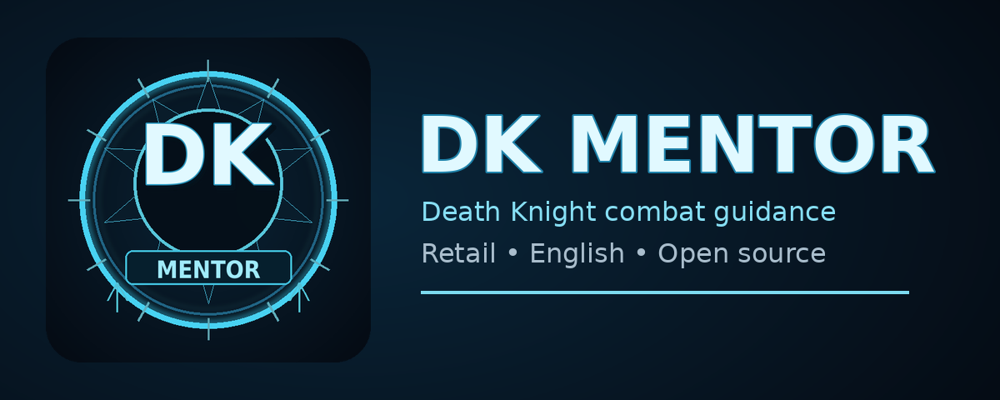

<p align="center"></p>

# DK Mentor

**DK Mentor** is a World of Warcraft Retail addon for Blood, Frost, and Unholy Death Knights. It combines Blizzard's native Assisted Combat highlighting with survival guidance, content-aware specialization/talent/equipment profiles, dynamic per-dungeon overrides, compact combat HUDs, a DK Ready Check with Runeforge/Ghoul guards, aura tracking, beginner guidance, and optional Lich King commentary.

The in-game UI automatically uses Brazilian Portuguese on `ptBR` clients and English on `enUS`/`enGB`; unsupported locales fall back to English.

## Highlights

- Blood, Frost, and Unholy specialization detection.
- World, Delve, Dungeon, Raid, and PvP context detection with automatic runtime switching.
- Blizzard Assisted Combat offensive highlighting; DK Mentor never casts abilities.
- Health-aware Survival Coach for defensive, healing, control, and utility priorities.
- Contextual **specialization + talent loadout + Equipment Set** profiles with independent Spec AUTO / Talents AUTO / Gear AUTO switching when WoW permits it.
- Dynamic **Dungeon Overrides** discovered from WoW Mythic+/Challenge Mode data and visited instances; each dungeon can inherit, keep current, or override specialization, talents, and gear independently.
- Dungeon/Raid role protection skips automatic Tank <-> DPS specialization changes that conflict with the player's assigned group role.
- Compact movable one-line Build HUD showing the specialization icon, detected content/dungeon, active build, associated gear, and DK READY; clicking the icon still opens manual spec switching.
- **DK Ready Check** in the Build HUD for mapped talents, mapped equipment, Death Knight Runeforge coverage, and the Unholy ghoul when applicable.
- **Runeforge Guard** validates a DK Runeforge on every equipped weapon without pretending one rune is universally best for all builds.
- **Ghoul Guard** warns Unholy Death Knights when their permanent pet is missing/dead, with travel/vehicle suppression.
- DK Buff Bar for important class buffs/procs using Blizzard's Retail 12.1 AuraContainer with a spec-aware Cooldown Manager whitelist; it defaults to five icons per row and can display up to 30 active tracked effects.
- External Buff Bar for helpful effects applied to you by other players or NPCs.
- Player Debuff Bar for harmful effects currently affecting your own character.
- DK Buffs, External Buffs, and Debuffs default to **five icons per row**, can be widened/narrowed independently, and grow upward when they wrap.
- Ability Availability Bar for important abilities, cooldowns, charges, and temporary unavailability.
- **DK Resources HUD** with all six Rune recharge segments plus a Runic Power bar; each resource can be shown independently.
- Optional icon-only **Mind Freeze interrupt alert** that appears for a confirmed interruptible cast/channel on your current target; it never casts the interrupt automatically.
- Combat-only visibility for DK Buffs, External Buffs, Debuffs, the Ability Bar, and DK Resources is the default; it can be switched to always-visible from Settings.
- Independent 70%-160% combat-HUD scaling, **30%-100% opacity**, configurable icons per row for icon bars, and a Runes / Runic Power / Both mode for DK Resources.
- HUD lock/unlock, hard-override preview, and reset-position workflow.
- Beginner Guide tab per specialization.
- Optional situational Lich King commentary using sound resources already installed by the WoW client; no Blizzard audio files are bundled.
- Minimap button positioned on the outer edge of the current Edit Mode minimap size.

## Retail 12.1 combat restrictions

Modern WoW can protect or hide some combat values from addons. DK Mentor does not attempt to bypass those restrictions. The addon uses Blizzard-owned APIs and UI mechanisms where available, including Assisted Combat, DurationObjects, proc events, and the Retail 12.1 AuraContainer/AuraButton system for dynamic player aura HUDs. The DK Resources HUD reads the six secondary Rune cooldowns normally. Runic Power is a primary resource and can become a secret value in combat, so DK Mentor passes it directly into Blizzard's native `StatusBar` value path and does not branch, threshold, or make recommendations from the hidden number.

When the game does not expose a restricted value, DK Mentor avoids pretending that the value is known.

## Installation

1. Download the CurseForge release ZIP or a GitHub release archive.
2. Extract the `DKMentor` folder to `World of Warcraft/_retail_/Interface/AddOns/`.
3. Confirm `World of Warcraft/_retail_/Interface/AddOns/DKMentor/DKMentor.toc` exists.
4. Enable **DK Mentor** on the AddOns screen.
5. Log in on a Death Knight and type `/dkm`.

## Main commands

```text
/dkm
/dkm help
/dkm mode auto|world|delve|dungeon|raid|pvp
/dkm coach on|off
/dkm build
/dkm gear
/dkm voice
/dkm buffs on|off
/dkm externalbuffs on|off
/dkm debuffs on|off
/dkm abilities on|off
/dkm resources on|off
/dkm resources runes on|off
/dkm resources power on|off
/dkm interrupt on|off
/dkm combatbars combat|always
/dkm ready
/dkm hud lock|unlock|preview
/dkm reset
```

## Loadouts 2.0

DK Mentor maps **existing** WoW talent loadouts and Equipment Sets to World, Delve, Dungeon, Raid, and PvP profiles. Each content profile can also choose Blood, Frost, Unholy, or **Do not change**. The three automation switches are independent: **Spec AUTO**, **Talents AUTO**, and **Gear AUTO**.

The Dungeon profile has an additional **Dungeon Overrides** manager. Dungeon entries are discovered dynamically from WoW's Challenge Mode/Mythic+ APIs and from instances you visit, so the addon does not need a hardcoded seasonal dungeon list. For each dungeon, specialization, talents, and gear can independently:

- inherit the normal Dungeon profile;
- keep the current value; or
- use an explicit override.

When grouped in Dungeon or Raid content, DK Mentor protects the assigned group role: it skips automatic Tank <-> DPS specialization switches that would conflict with the role. This guard does not remove the normal manual specialization selector on the Build HUD.

No third-party talent import strings are bundled. Build panels link to attributed public guide sources; players can store their own import strings locally in `DKMentorDB`.


## DK Ready Check

The Build HUD includes a compact readiness result and a detailed hover tooltip. It checks only player-owned/configuration state: the content-mapped talent loadout, the mapped Equipment Set, permanent Runeforge enchants on equipped weapons, and the Unholy pet when Raise Dead is available.

Runeforge Guard answers **"is this a Death Knight Runeforge?"**, not **"is this always the mathematically best rune?"**. Rune choice can vary by build and encounter, so the addon avoids presenting a universal optimization claim.

Use `/dkm ready` for a chat report while testing.

## DK Resources HUD

The optional **DK Resources** HUD keeps the Death Knight resource loop close to the other combat bars:

- Six Rune segments show ready/recharging state.
- A Runic Power bar follows the player resource using Blizzard's native status-bar rendering path.
- Settings can show **Runes + Runic Power**, **Runes only**, or **Runic Power only**.
- The HUD has its own 70%-160% scale, 30%-100% opacity, saved position, lock/unlock behavior, Preview support, and the same Combat only / Always visibility rule as the other combat HUDs.
- Runic Power text can be hidden for a cleaner visual, and Rune spacing can be switched between Compact, Normal, and Wide.
- **Restore DK Resources** resets only this HUD without changing the other combat HUDs.
- In restricted combat, the Runic Power fill may remain live while its numeric text is intentionally omitted if the underlying number is secret.

## Aura HUDs

The addon provides three separate aura concepts:

- **DK Buffs**: important self buffs/procs for the active Death Knight specialization.
- **External Buffs**: positive effects on the player supplied by other players/NPCs.
- **Debuffs**: negative effects currently affecting the player character.

DK Buffs, External Buffs, and Debuffs use Blizzard's Retail aura-container system so the game client owns aura assignment and refreshes during restricted combat. DK Buffs uses a spell-ID whitelist assembled from spec data and current Cooldown Manager profiles; DK Mentor never branches on secret aura presence to decide what should be shown. The HUDs are display-only and do not automate reactions.

## Lich King commentary

The commentary feature is optional and disabled by default. It references numeric sound resources already present in the player's installed WoW client. DK Mentor does not include, extract, modify, or redistribute Blizzard audio files or dialogue transcripts.

## Publishing and project policy

- [1.2.0 live test checklist](TESTING_v1.2.0.md)
- [Publishing guide](PUBLISHING.md)
- [Policy and sources](POLICY_AND_SOURCES.md)
- [Third-party notices](THIRD_PARTY_NOTICES.md)
- [Security policy](SECURITY.md)
- [Support](SUPPORT.md)

## License

DK Mentor source code is released under the [MIT License](LICENSE).

## Credits and trademarks

Developed and maintained by **Thiago Bertuzzi** with AI-assisted implementation and documentation.

World of Warcraft, Warcraft, the Lich King, and Blizzard Entertainment are trademarks or registered trademarks of Blizzard Entertainment, Inc. DK Mentor is an independent community project and is not affiliated with or endorsed by Blizzard Entertainment.
